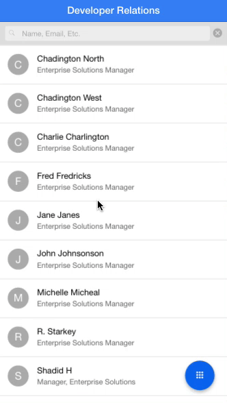

# Ionic Avatar Spinner Directive

A custom Ionic directive which mimics the experience one would see in the gmail app. When an avatar is clicked on, it spins and changes to a checkmark. This shows the user of the app that a list-item has been selected.

The directive creates an Array of objects, in my use-case it's Contacts, which can then be used to perform bulk tasks such as Email, SMS, Delete, etc.

**Applies To**

* [Ionic Framework](http://www.ionicframework.com)
* [AngularJS](http://angularjs.org/)

**Author**

* [Chad Tetreault](http://www.twitter.com/chadtatro)

**Demo**

Over-all I'm pretty happy with the performance of the animations of this directive. When tested on device, it runs at ~60fps. Of course, the animated GIF does not run at 60fps, so please keep that in mind. :)



**Getting Started**

This directive was designed for Ionic's [ion-list](http://ionicframework.com/docs/api/directive/ionList/) directive, and accepts 2 parameters.

- label: (String), Text label to display
- item-data: (Object), List-item data

```
<ion-list>
    <ion-item ng-repeat="contact in contacts" class="item-avatar-left">
        <avatar-spinner label="{{contact.FirstName.charAt(0)}}" item-data="{{contact}}"></avatar-spinner>
        <div ng-click="viewContact(contact.idContact, $event)">
            <h2>{{ contact.FirstName }} {{ contact.LastName }}</h2>
            <p>{{ contact.Title }}, {{ contact.AccountName }}</p>
        </div>
    </ion-item>
</ion-list>
```

The item-data Object currently must contain an `id` key. The ID itself can be anything unique you wish to use.

```
var Contact = {
  id: '3s9d9vsd_',
  ...
}
```

**Helper Methods**

There are a couple methods included that I use. They may be a bit specific to my case, but I felt they were good to leave in the code.


- Clear all selected items
```
  clearAllSelections()
```

- Clear an individual item
```
  clearSelection(thisElement, parentEl, lastNameInitialEl, checkmarkEl, id)
```


## Contributing Changes

Please see the [README](https://github.com/blackberry/BB10-WebWorks-Samples) of the BB10-WebWorks-Samples repository for instructions on how to add new Samples or make modifications to existing Samples.

## Bug Reporting and Feature Requests

If you find a bug in a Sample, or have an enhancement request, simply file an [Issue](https://github.com/blackberry/BB10-WebWorks-Samples/issues) for the Sample.

## Disclaimer

THE SOFTWARE IS PROVIDED "AS IS", WITHOUT WARRANTY OF ANY KIND, EXPRESS OR IMPLIED, INCLUDING BUT NOT LIMITED TO THE WARRANTIES OF MERCHANTABILITY, FITNESS FOR A PARTICULAR PURPOSE AND NON-INFRINGEMENT. IN NO EVENT SHALL THE AUTHORS OR COPYRIGHT HOLDERS BE LIABLE FOR ANY CLAIM, DAMAGES OR OTHER LIABILITY, WHETHER IN AN ACTION OF CONTRACT, TORT OR OTHERWISE, ARISING FROM, OUT OF OR IN CONNECTION WITH THE SOFTWARE OR THE USE OR OTHER DEALINGS IN THE SOFTWARE.
